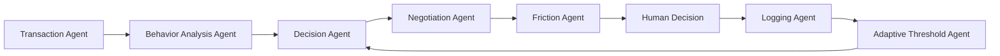
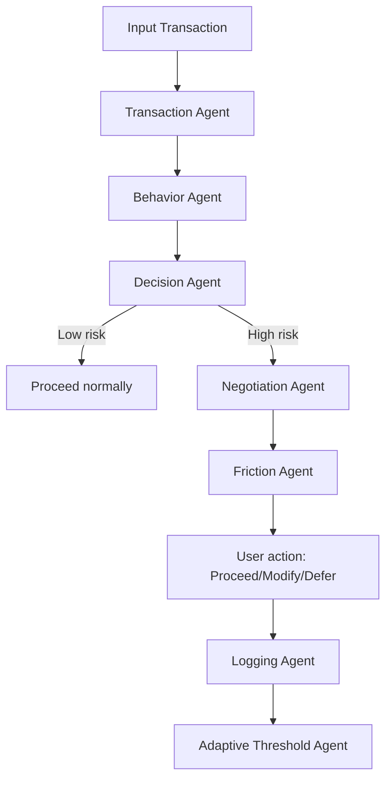
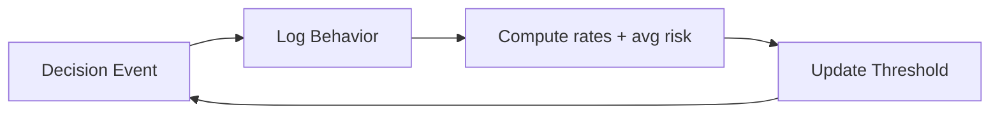
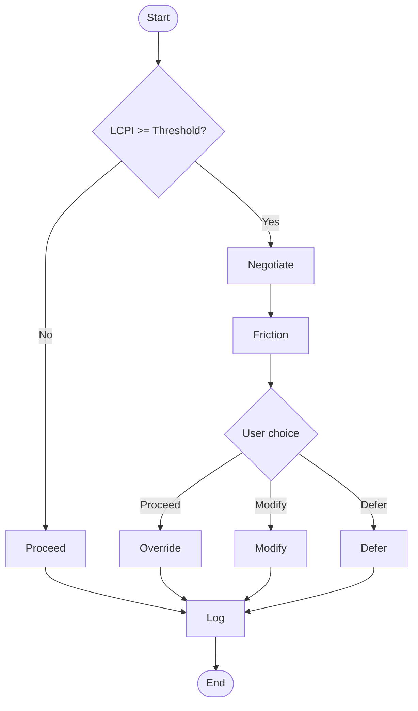

# Autonomous Financial Behavioral Regulator (AFBR) – Simplified Agentic AI Prototype

A submission-ready, educational prototype **inspired by AFBR concepts** that predicts impulsive spending before confirmation and performs negotiation + strategic friction with human-in-the-loop final control.

---

## 1) Project Overview

AFBR is a multi-agent decision system for transaction-time behavioral regulation:

- User enters a transaction.
- Agents compute behavioral risk (LCPI).
- If risk is high, the system intervenes with negotiation and strategic friction.
- User makes the final decision (proceed / modify / defer).
- Outcome is logged to MongoDB.
- Adaptive threshold updates future intervention sensitivity.

---

## 2) Problem Statement

Conventional finance apps are mostly passive ledgers. They do not intervene exactly when impulsive purchases occur. This project addresses that gap by adding **agentic, real-time behavioral decision support** before transaction confirmation.

---

## 3) AFBR Inspiration

This prototype is **inspired by AFBR-style behavioral regulation ideas** (predictive intervention, strategic friction, closed-loop adaptation), but it is not a patent-complete implementation.

---

## 4) Novelty of the System

- Negotiation before confirmation.
- Strategic friction based on risk severity.
- Human-in-the-loop final control (never hard blocks transactions).
- Closed-loop threshold adaptation from behavioral outcomes.
- Modular multi-agent architecture with explicit inter-agent communication.

---

## 5) Why This Is Agentic AI

This system demonstrates Agentic AI because it uses autonomous specialized agents that exchange outputs in sequence to reach a final recommendation, includes conditional intervention logic, and updates policy from observed behavior.

---

## 6) Architecture Explanation

The system contains these mandatory agents:

1. **Transaction Agent** – collects/normalizes input.
2. **Behavior Analysis Agent** – computes features and LCPI using MongoDB history.
3. **Decision Agent** – threshold-based intervention logic.
4. **Negotiation Agent** – LLM/fallback negotiation prompt.
5. **Friction Agent** – warning / delay / reason policy + budget impact.
6. **Logging Agent** – writes transaction + behavior logs to MongoDB.
7. **Adaptive Threshold Agent** – updates threshold based on recent outcomes.

---

## 7) Agent Workflow Explanation

Input transaction → Transaction Agent → Behavior Analysis Agent → Decision Agent → (if high risk) Negotiation Agent → Friction Agent → User choice (proceed/modify/defer) → Logging Agent → Adaptive Threshold Agent → next cycle.

---

## 8) MongoDB Schema

Database: `afbr_db`

### Collection: `transactions`
- `amount` (float)
- `category` (string)
- `timestamp` (datetime)
- `remaining_budget` (float)

### Collection: `behavior_logs`
- `transaction_id` (string)
- `lcpi_score` (float)
- `decision` (`proceed` | `modify` | `defer`)
- `override` (bool)
- `friction_level` (string)
- `threshold` (float)
- `reason` (string)
- `timestamp` (datetime)

### Collection: `settings`
- `key` (`risk_threshold`)
- `value` (float)

---

## 9) LCPI Formula Explanation

Rule-based LCPI:

\[
LCPI = 0.4 \times \frac{amount}{remaining\_budget}
+ 0.2 \times \frac{transactions\_today}{10}
+ 0.2 \times category\_spending\_ratio
+ 0.2 \times late\_night\_flag
\]

- `late_night_flag` is 1 for risky late hours, else 0.
- Score is clamped to `[0,1]`.
- Historical signals are computed from `transactions` collection.

---

## 10) Strategic Friction Explanation

Friction levels:

- **warning**: alert only.
- **delay**: 10-second timer.
- **reason**: 10-second timer + reason input.

The user still retains final choice (proceed / modify / defer).

---

## 11) Adaptive Threshold Explanation

After each decision, recent `behavior_logs` are analyzed:

- override rate,
- defer rate,
- average LCPI.

Threshold is adjusted (bounded between `0.35` and `0.85`) and saved in MongoDB `settings`.

---

## 12) Setup Instructions

### A) MongoDB Atlas / Local Setup

1. Create MongoDB cluster (Atlas) or run local MongoDB.
2. Copy connection URI.
3. Create `.env` from `.env.example` and paste URI.

### B) Environment Configuration

```bash
cp .env.example .env
# edit .env with your values
```

### C) Install Dependencies

```bash
python -m venv .venv
source .venv/bin/activate   # Windows: .venv\\Scripts\\activate
pip install -r requirements.txt
```

---

## 13) How to Run

```bash
streamlit run afbr_agentic/app.py
```

Streamlit multipage automatically shows:
- Main app (`app.py`)
- Explanation page (`pages/explanation.py`)

---

## 14) Example Test Scenarios

### Scenario A: Low risk case
- Small amount, daytime, healthy remaining budget.
- Expected: low LCPI, no strong intervention.

### Scenario B: High risk case
- Large amount, low remaining budget, late-night timing.
- Expected: intervention + negotiation + friction.

### Scenario C: Override case
- High-risk flagged transaction but user selects proceed.
- Expected: override logged and adaptive threshold updated.

---

## 15) Mermaid Diagrams

### 15.1 System Architecture



### 15.2 Agent Workflow



### 15.3 Closed-loop Feedback



### 15.4 Decision Flowchart



---

## 16) Folder Structure Explanation

```text
afbr_agentic/
├── app.py
├── pages/
│   └── explanation.py
├── agents/
│   ├── transaction_agent.py
│   ├── behavior_agent.py
│   ├── decision_agent.py
│   ├── negotiation_agent.py
│   ├── friction_agent.py
│   ├── logging_agent.py
│   └── threshold_agent.py
├── database/
│   └── mongo_client.py
└── utils/
    └── lcpi_calculator.py

README.md
requirements.txt
.env.example
```

---

## 17) Submission Notes

- Designed for academic demo/viva with clear Agentic AI decomposition.
- Uses MongoDB-first persistence with `.env` configuration.
- Includes explanation page and renderable Mermaid diagrams in Streamlit.
