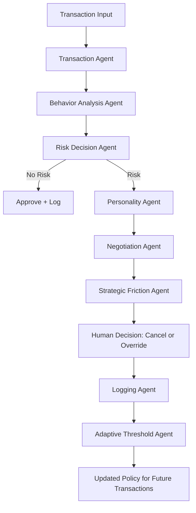
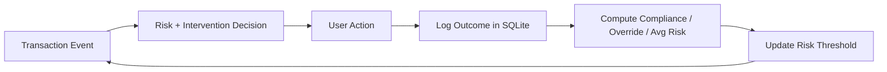
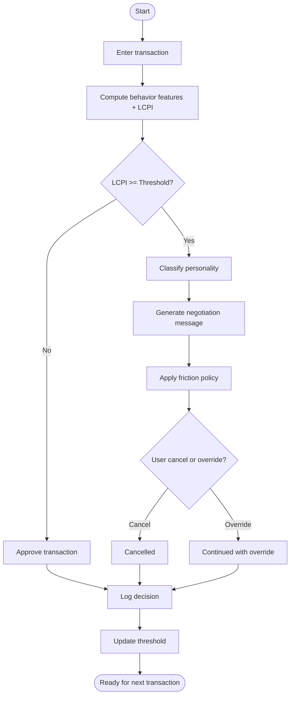

# Agentic AI Financial Decision Regulator (Simplified AFBR)

A student-level, end-to-end **multi-agent AI system** that predicts impulsive spending and performs **negotiation + strategic friction** before allowing a transaction.

> This is intentionally built as an **Agentic AI architecture**, not a simple budgeting app.

---

## 1) Project Overview

The **Agentic AI Financial Decision Regulator (AFBR)** is a human-centered financial control simulator that intercepts spending decisions at transaction time.

Instead of merely tracking expenses, AFBR runs a sequence of autonomous, specialized agents that:

1. assess behavioral risk,
2. decide whether intervention is needed,
3. negotiate with the user in a personality-aware style,
4. apply strategic friction,
5. capture the user's final action,
6. update future decision policies using behavioral feedback.

This creates a **closed-loop behavior regulation system**.

---

## 2) Problem Statement

Many consumers make impulsive purchases under emotional pressure, poor timing (late-night), or budget blind spots. Traditional budgeting tools are passive; they do not intervene at the moment of decision.

AFBR addresses this by providing:

- real-time behavioral risk scoring,
- agentic intervention only when needed,
- friction calibrated to risk severity,
- adaptive policy updates from user behavior.

---

## 3) Why This Is Novel (System Novelty)

AFBR includes all required novelty features:

- **Negotiation before confirmation** (LLM-backed or deterministic fallback).
- **Strategic friction system** (warning / timer / mandatory reason).
- **Adaptive threshold learning** from compliance and override patterns.
- **Behavioral personality classification** that alters intervention tone.
- **Closed-loop behavioral feedback** using logged outcomes.
- **Multi-agent decision architecture** with sequential handoffs.

---

## 4) Agentic AI Principles Demonstrated

This project clearly demonstrates:

- **Autonomous agents**: each module has a bounded role.
- **Inter-agent communication**: outputs from one agent become inputs to the next.
- **Decision making**: risk and friction policies are applied conditionally.
- **Human-in-the-loop**: user can cancel or override after intervention.
- **Feedback loop**: logs are used to adapt threshold over time.
- **Adaptive system behavior**: intervention sensitivity changes with user history.

---

## 5) Agent Architecture

## Implemented Agents

1. **Transaction Agent** (`agents/transaction_agent.py`)
   - Collects and normalizes transaction data: amount, category, remaining budget, timestamp.

2. **Behavior Analysis Agent** (`agents/behavior_agent.py`)
   - Computes behavioral features:
     - spend velocity,
     - category overspending,
     - time-of-transaction late-night flag,
     - budget deviation,
     - LCPI risk score.

3. **Risk Decision Agent** (`agents/risk_agent.py`)
   - Compares LCPI score against adaptive threshold.
   - Decides whether to trigger intervention.

4. **Personality Agent** (`agents/personality_agent.py`)
   - Classifies behavior style:
     - Impulsive,
     - Planned,
     - Risky,
     - Goal-Oriented.
   - Provides rationale and influences negotiation tone.

5. **Negotiation Agent (LLM Agent)** (`agents/negotiation_agent.py`)
   - Generates negotiation prompts:
     - goal delay,
     - liquidity impact,
     - budget redistribution,
     - alternatives.
   - Uses OpenAI if key exists; safe fallback if not.

6. **Strategic Friction Agent** (`agents/friction_agent.py`)
   - Applies friction level by severity:
     - Low: warning,
     - Medium: timed delay,
     - High: mandatory reason.

7. **Logging Agent** (`agents/logging_agent.py`)
   - Persists risk/decision/override/friction/timestamp and context into SQLite.

8. **Adaptive Threshold Agent** (`agents/threshold_agent.py`)
   - Updates risk threshold using compliance rate, override rate, and average risk.

---

## 6) Workflow Explanation

Required workflow is implemented exactly:

**Transaction Input → Behavior Agent → Risk Agent → (if risk) Personality Agent → Negotiation Agent → Friction Agent → User Decision → Logging Agent → Adaptive Threshold Update → Loop**

Each new decision influences future threshold sensitivity.

---

## 7) LCPI Formula Explanation

AFBR implements:

\[
LCPI = 0.4*(amount / remaining\_budget) + 0.2*(transactions\_today / 10) + 0.2*(category\_spending\_ratio) + 0.2*(late\_night\_flag)
\]

Where:

- `amount / remaining_budget` captures immediate budget stress.
- `transactions_today / 10` approximates spend velocity pressure.
- `category_spending_ratio` captures concentration/overspend tendency.
- `late_night_flag` (0/1) penalizes high-risk timing.

Final LCPI is clamped to `[0, 1]`.

---

## 8) Adaptive Threshold Explanation

A baseline threshold (`settings.risk_threshold`) starts at 0.55.

After each transaction, threshold is updated by:

- **Override rate high** → raise threshold slightly (avoid over-alerting).
- **Override rate low** → lower threshold slightly (increase sensitivity).
- **Compliance rate high** → modestly raise threshold.
- **Compliance rate low** → modestly lower threshold.
- **Average risk high** → slight sensitivity increase.

Threshold is bounded to `[0.35, 0.85]` for stability.

---

## 9) Personality Agent Explanation

The personality classifier uses aggregate behavior metrics:

- average risk,
- override frequency,
- compliance/savings focus.

Output class influences message style:

- **Impulsive**: firm and consequence-focused,
- **Risky**: analytical and caution-oriented,
- **Planned**: supportive and balanced,
- **Goal-Oriented**: motivational and objective-protecting.

---

## 10) System Architecture Diagram (ASCII)

```text
+-------------------+      +-----------------------+      +------------------+
| Transaction Agent | ---> | Behavior Analysis     | ---> | Risk Decision    |
| (collect input)   |      | Agent (LCPI + feats)  |      | Agent            |
+-------------------+      +-----------------------+      +------------------+
                                                              |
                                                              | intervene?
                                                              v
                   +------------------+   +-------------------+   +----------------------+
                   | Personality Agent|-> | Negotiation Agent |-> | Strategic Friction   |
                   | (behavior type)  |   | (LLM message)     |   | Agent                |
                   +------------------+   +-------------------+   +----------------------+
                                                              |
                                                              v
                                                       +-------------+
                                                       | User Choice |
                                                       +-------------+
                                                              |
                                                              v
+--------------------+      +------------------------+      +----------------------+
| Logging Agent      | ---> | Adaptive Threshold     | ---> | Next Transaction Loop|
| (store outcomes)   |      | Agent (policy update)  |      | (closed loop)        |
+--------------------+      +------------------------+      +----------------------+
```

---

## 11) Agent Workflow Diagram (Mermaid)



---

## 12) Closed-Loop Feedback Diagram (Mermaid)



---

## 13) End-to-End Process Flowchart (Mermaid)



---

## 14) Folder Structure

```text
afbr_agentic/
├── app.py
├── agents/
│   ├── behavior_agent.py
│   ├── friction_agent.py
│   ├── logging_agent.py
│   ├── negotiation_agent.py
│   ├── personality_agent.py
│   ├── risk_agent.py
│   ├── threshold_agent.py
│   └── transaction_agent.py
├── database/
│   └── .gitkeep
└── utils/
    └── db.py

README.md
requirements.txt
```

---

## 15) Installation Steps

1. Clone/open the repository.
2. Create a virtual environment.
3. Install dependencies.

```bash
python -m venv .venv
source .venv/bin/activate   # Windows: .venv\\Scripts\\activate
pip install -r requirements.txt
```

Optional LLM support:

```bash
export OPENAI_API_KEY="your_key_here"
```

Without API key, the Negotiation Agent uses deterministic fallback messaging.

---

## 16) How to Run

From repository root:

```bash
streamlit run afbr_agentic/app.py
```

Then open the shown local URL (usually `http://localhost:8501`).

---

## 17) Example Workflow

1. User enters `$240` shopping transaction with `$500` remaining budget at `23:40`.
2. Behavior Agent computes a high LCPI due to amount ratio + late-night flag.
3. Risk Agent triggers intervention (score >= threshold).
4. Personality Agent classifies user profile from history (e.g., Risky).
5. Negotiation Agent offers delay/liquidity/redistribution/alternative message.
6. Friction Agent applies medium/high friction.
7. User cancels or overrides.
8. Logging Agent stores full record.
9. Threshold Agent adjusts policy for next cycle.

---

## 18) SQLite Data Model

- `transactions`: raw transaction inputs.
- `decisions`: intervention details and user outcomes.
- `settings`: mutable threshold policy state.

This supports analytics and closed-loop adaptation.

---

## 19) Why This Is Clearly Agentic (Not Just Budget Tracking)

- Uses **multiple autonomous agents** with specialized responsibility.
- Includes explicit **sequential inter-agent reasoning pipeline**.
- Makes **conditional interventions** based on risk policy.
- Includes **negotiation and strategic friction**, not just display/reporting.
- Requires **human action** to finalize high-risk events.
- Learns from outcomes through **policy adaptation**.

---

## 20) Future Improvements

- Replace heuristic personality model with temporal sequence model.
- Add reinforcement learning for adaptive friction policy.
- Support multi-user authentication and profile isolation.
- Integrate real bank transaction feeds (Plaid/Open Banking).
- Add fairness constraints and explainability scorecards.
- Add notification channels (SMS/email) and coach-style nudges.
- Build simulation mode for A/B testing friction strategies.

---

## 21) Tech Stack

- Python
- Streamlit
- SQLite
- OpenAI API (optional but supported)
- Matplotlib
- Pandas

